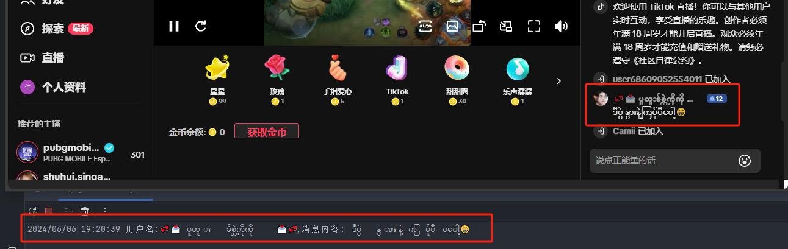
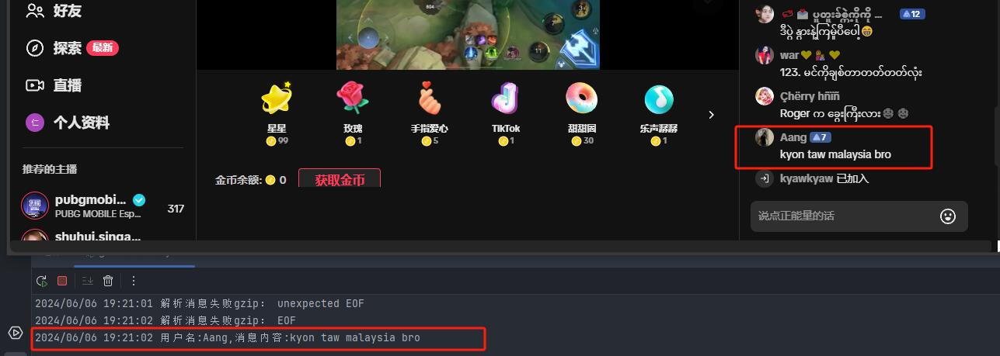

# TikTok 直播弹幕抓取工具

🎬 基于 WebSocket 的 TikTok 直播实时数据抓取工具，支持弹幕、礼物、点赞等多种消息类型。

[](https://github.com/jwwsjlm/TikTok_Live/releases)
[](LICENSE)
[](https://golang.org)

---

## ✨ 功能特性

- 🚀 **实时监控** - WebSocket 推送，毫秒级延迟
- 📊 **多房间支持** - 单进程监控多个直播间
- 🏀 **流整数据* *- 弹幕、礼物、点赞、关注、进场等消息
- 🔧 **灵活配置** - 配置文件 + 命令行参数双支持
- 💡 **友好提示** - 详细的错误提示和解决方法
- 🛠️ **易于集成** - JSON 格式输出，方便二次开发

---

## 🚀 快速开始

### 方式一：下载编译好的程序（推荐）

1. 从 [Releases](https://github.com/jwwsjlm/TikTok_Live/releases) 下载最新版本
2. 在同目录创建 `config.yaml` 配置文件：
   ```yaml
   port: 1088
   room: "tiktok 直播间号"
   unknown: false
   ```
3. 双击运行或命令行启动：
   ```bash
   ./TikTok_Live
   ```

### 方式二：命令行启动

```bash
./TikTok_Live --room 7123456789012345678 --port 1088
```

### 方式三：源码编译

```bash
# 环境要求：Go 1.21+
git clone https://github.com/jwwsjlm/TikTok_Live.git
cd TikTok_Live
go build -o TikTok_Live main.go
```

---

## 📖 使用说明

### 启动服务

```bash
# 使用配置文件（推荐）
./TikTok_Live

# 使用命令行参数
./TikTok_Live --room 7123456789012345678 --port 1088 --unknown false
```

### 连接 WebSocket

服务启动后，客户端可以通过 WebSocket 连接：

```
ws://127.0.0.1:1088/ws/直播间号
```

**示例：**
```javascript
const ws = new WebSocket('ws://127.0.0.1:1088/ws/7123456789012345678');

ws.onmessage = (event) => {
    const data = JSON.parse(event.data);
    console.log('收到消息:', data);
};

// 发送心跳（每 30 秒一次）
setInterval(() => {
    ws.send('ping');
}, 30000);
```

### 多房间监控

单个进程即可监控多个直播间：

```bash
# 启动服务
./TikTok_Live

# 客户端 A 连接房间 1
ws://127.0.0.1:1088/ws/7123456789012345678

# 客户端 B 连接房间 2
ws://127.0.0.1:1088/ws/7987654321098765432
```

---

## ⚙️ 配置说明

### 配置文件 (config.yaml)

```yaml
# WebSocket 服务端口（默认：1088）
port: 1088

# TikTok 直播间号（必填）
room: "7123456789012345678"

# 是否输出未知类型的消息（默认：false）
unknown: false
```

### 命令行参数

| 参数 | 说明 | 默认值 |
|------|------|--------|
| `--room` | TikTok 直播间号 | 必填 |
| `--port` | WebSocket 服务端口 | 1088 |
| `--unknown` | 是否输出未知消息类型 | false |
| `--config` | 指定配置文件路径 | config.yaml |

---

## 📡 消息类型

支持的消息类型（持续更新中）：

| 类型 | 说明 |
|------|------|
| `WebcastChatMessage` | 弹幕消息 |
| `WebcastGiftMessage` | 礼物消息 |
| `WebcastLikeMessage` | 点赞消息 |
| `WebcastMemberMessage` | 进场消息 |
| `WebcastSocialMessage` | 关注消息 |
| `WebcastRoomUserSeqMessage` | 在线观众列表 |
| `WebcastControlMessage` | 控制消息（开播/下播） |

---

## 🔧 高级用法

### 心跳机制

客户端需要每 30 秒发送一次心跳：

```javascript
ws.send('ping');
```

服务端会回复 `pong`，保持连接活跃。

### 错误处理

```javascript
ws.onerror = (error) => {
    console.error('WebSocket 错误:', error);
};

ws.onclose = () => {
    console.log('连接已关闭，尝试重连...');
    setTimeout(connect, 5000);
};
```

### 消息解析示例

```javascript
ws.onmessage = (event) => {
    const msg = JSON.parse(event.data);
    
    switch (msg.type) {
        case 'WebcastChatMessage':
            console.log(`弹幕：${msg.user.nickname} - ${msg.content}`);
            break;
        case 'WebcastGiftMessage':
            console.log(`礼物：${msg.user.nickname} 赠送了 ${msg.gift.name}`);
            break;
        case 'WebcastLikeMessage':
            console.log(`点赞：${msg.user.nickname} 点赞了直播间`);
            break;
    }
};
```

---

## 🛠️ 开发指南

### 项目结构

```
TikTok_Live/
├── main.go          # 程序入口
├── struct.go        # 数据结构定义
├── tiktok_hack/     # TikTok 协议解析
├── protobuf/        # Proto 定义文件
├── generated/       # 生成的代码
├── utils/           # 工具函数
└── config.yaml_bak  # 配置示例
```

### 添加新的消息类型

1. 在 `protobuf/` 目录下更新 `.proto` 文件
2. 在 `main.go` 中添加消息处理逻辑

Proto 文件参考：
- 社区版本：https://github.com/isaackogan/TikTokLive

---

## 📸 运行截图

### 服务启动


### 消息接收


---

## 🙏 致谢

本项目灵感来自：
- [SunnyNet](https://github.com/qtgolang/SunnyNet)
- [TikTokLive](https://github.com/isaackogan/TikTokLive)

感谢以上作者的无私贡献！

相关项目：
- [抖音直播弹幕抓取](https://github.com/jwwsjlm/douyinLive) - 抖音平台版本

---

## 📄 许可证

MIT License

---

## 🐛 问题反馈

遇到问题？欢迎提 [Issue](https://github.com/jwwsjlm/TikTok_Live/issues)！

常见错误及解决方法：

| 错误 | 原因 | 解决方法 |
|------|------|----------|
| 直播间号不能为空 | 未配置直播间号 | 在 config.yaml 中设置 room 或使用 --room 参数 |
| 配置文件未找到 | config.yaml 不在 exe 同目录 | 将配置文件放到程序同目录，或使用 --config 指定路径 |
| 端口被占用 | 1088 端口已被使用 | 使用 --port 指定其他端口 |

---

## 📬 联系方式

- GitHub: [@jwwsjlm](https://github.com/jwwsjlm)
- 博客: https://blog.xsojson.com

---

**如果这个项目对你有帮助，欢迎 Star ⭐️ 支持一下！**
